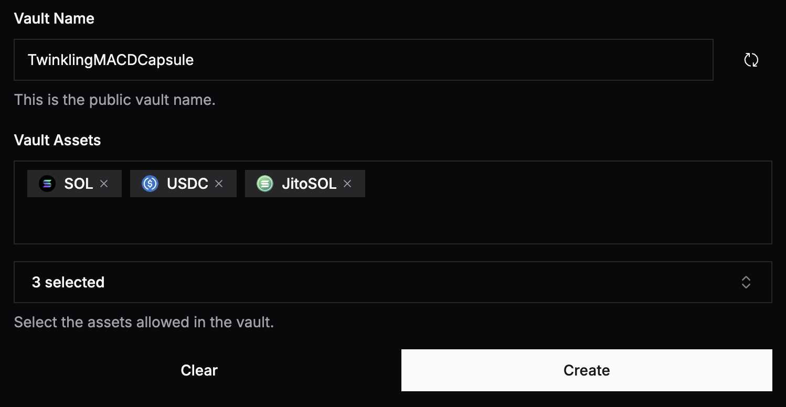

# Risk Management

## Assets Allowlist

When creating a vault, the manager can select a list of allowed assets (this assets allowlist can be updated later on by the manager on the Vault - Context page).

<figure><figcaption></figcaption></figure>

This allowlist is essential for mitigating the risk of inadvertently or maliciously swapping into high-risk assets (e.g., memecoins) by a delegate.
